# Credit Risk Analysis
This project focused on the application of various supervised Machine Learning techniques for performing efficient ETL and solving a real-world case study based on systematic statistical reasoning.

## Table of Contents

- [Overview of Project](#overview-of-project)
  - [Resources](#resources)
  - [Challenge Overview](#challenge-overview)
  - [GitHub Repo Branches](#github-repo-branches)
- [Deliverable 1: Use Resampling Models to Predict Credit Risk](#deliverable-1-use-resampling-models-to-predict-credit-risk)
  - [Naive Random Oversampling](#naive-random-oversampling)
  - [SMOTE Oversampling](#SMOTE-oversampling)
  - [Cluster Centroid Undersampling](#cluster-centroid-undersampling)
- [Deliverable 2: Use the SMOTEENN Algorithm to Predict Credit Risk](#deliverable-2-use-the-smoteenn-algorithm-to-predict-credit-risk)
- [Deliverable 3: Use Ensemble Classifiers to Predict Credit Risk](#deliverable-3-use-ensemble-classifiers-to-predict-credit-risk)
  - [Balanced Random Forest Classifier](#balanced-random-forest-classifier)
  - [Easy Ensemble Classifier](#easy-ensemble-classifier)
  - [Adaptive Boosting Classifier](#adaptive-boosting-classifier)
- [Summary](#summary)
- [References](#references)

## Overview of Project

This project and Module 18 assignment focused on cultivating knowledge and skills in data preparation, statistical reasoning, and machine learning (ML), which were required for solving a real-world challenge: credit card risk. During the completion of this project we mainly leveraged the powerful features offered by [Scikit-learn User Guide - Supervised Learning](https://scikit-learn.org/stable/supervised_learning.html), [Python imbalanced-learn](https://pypi.org/project/imbalanced-learn/), and their supporting packages/libraries/dependencies that let us explore, train, and study various supervised learning models and resources, such as random oversampling technique (RandomOverSampler), synthetic minority oversampling technique (SMOTE), cluster centroid undersampling technique (ClusterCentroids), and a combination of SMOTE and edited nearest neighbors algorithms (SMOTEENN). We also adopted two advanced ensemble methods that reduce bias to further verify the performance of each model.

### Resources

- Source code: [credit_risk_resampling.ipynb](./credit_risk_resampling.ipynb), [credit_risk_ensemble.ipynb](./credit_risk_ensemble.ipynb).
- Source data: [LoanStats_2019Q1.csv](./Resources/LoanStats_2019Q1.csv).
- Image file: png files.
- Software: [Pandas User Guide](https://pandas.pydata.org/pandas-docs/stable/user_guide/index.html#user-guide), [Scikit-learn User Guide - Supervised Learning](https://scikit-learn.org/stable/supervised_learning.html), [Python imbalanced-learn](https://pypi.org/project/imbalanced-learn/).

### Challenge Overview

To study credit risk that is an inherently unbalanced classification problem, as good loans easily outnumber risky loans, we employed different algorithms to train and evaluate models with unbalanced classes. We used a combinatorial approach of over- and under-sampling using the SMOTEENN algorithm. Next, we compared two new machine learning models that reduce bias, BalancedRandomForestClassifier and EasyEnsembleClassifier, to predict credit risk. We then evaluated the performance of these models versus the performance of the over- and/or under-sampling algorithms, and composed a written recommendation on whether they should be used to predict credit risk.

Below is the outline of our deliverables and a written report for presenting our results and analysis summary. It consists of three technical analysis deliverables and a summary of our study on the credit risk analysis.

- ☑️ Deliverable 1: Use Resampling Models to Predict Credit Risk.
- ☑️ Deliverable 2: Use the SMOTEENN Algorithm to Predict Credit Risk.
- ☑️ Deliverable 3: Use Ensemble Classifiers to Predict Credit Risk.
- ☑️ Deliverable 4: A Written Report on the Credit Risk Analysis (this ["README.md"](./README.md)).

### GitHub Repo Branches

All required deliverables are committed in this GitHub repo as outlined below.  

main branch  
|&rarr; [./README.md](./README.md)  
|&rarr; [./credit_risk_resampling.ipynb](./credit_risk_resampling.ipynb)  
|&rarr; [./credit_risk_ensemble.ipynb](./credit_risk_ensemble.ipynb)  
|&rarr; ./Resources/  
  &emsp; |&rarr; [./Resources/LoanStats_2019Q1.csv](./Resources/LoanStats_2019Q1.csv)  
|&rarr; ./Data/  
  &emsp; |&rarr; [./Data/RandomOverSampler_nen100_rsn1_cm.png](./Data/RandomOverSampler_nen100_rsn1_cm.png)  
  &emsp; |&rarr; [./Data/RandomOverSampler_nen100_rsn1_iclf_report.png](./Data/RandomOverSampler_nen100_rsn1_iclf_report.png)  
  &emsp; |&rarr; [./Data/SMOTE_nen100_rsn1_cm.png](./Data/SMOTE_nen100_rsn1_cm.png)  
  &emsp; |&rarr; [./Data/SMOTE_nen100_rsn1_iclf_report.png](./Data/SMOTE_nen100_rsn1_iclf_report.png)  
  &emsp; |&rarr; [./Data/ClusterCentroids_nen100_rsn1_cm.png](./Data/ClusterCentroids_nen100_rsn1_cm.png)  
  &emsp; |&rarr; [./Data/ClusterCentroids_nen100_rsn1_iclf_report.png](./Data/ClusterCentroids_nen100_rsn1_iclf_report.png)  
  &emsp; |&rarr; [./Data/SMOTEENN_nen100_rsn1_cm.png](./Data/SMOTEENN_nen100_rsn1_cm.png)  
  &emsp; |&rarr; [./Data/SMOTEENN_nen100_rsn1_iclf_report.png](./Data/SMOTEENN_nen100_rsn1_iclf_report.png)  
  &emsp; |&rarr; [./Data/brf_nen100_rsn1_cm.png](./Data/brf_nen100_rsn1_cm.png)  
  &emsp; |&rarr; [./Data/brf_nen100_rsn1_iclf_report.png](./Data/brf_nen100_rsn1_iclf_report.png)  
  &emsp; |&rarr; [./Data/brf_model_sorted_feature_importance.png](./Data/brf_model_sorted_feature_importance.png)  
  &emsp; |&rarr; [./Data/brf_model_sorted_feature_importance.csv](./Data/brf_model_sorted_feature_importance.csv)  
  &emsp; |&rarr; [./Data/EasyEnsembleClassifier_nen100_rsn1_cm.png](./Data/EasyEnsembleClassifier_nen100_rsn1_cm.png)  
  &emsp; |&rarr; [./Data/EasyEnsembleClassifier_nen100_rsn1_iclf_report.png](./Data/EasyEnsembleClassifier_nen100_rsn1_iclf_report.png)  
  &emsp; |&rarr; [./Data/AdaBoostClassifier_nen100_rsn1_cm.png](./Data/AdaBoostClassifier_nen100_rsn1_cm.png)  
  &emsp; |&rarr; [./Data/AdaBoostClassifier_nen100_rsn1_iclf_report.png](./Data/AdaBoostClassifier_nen100_rsn1_iclf_report.png)  

## Deliverable 1: Use Resampling Models to Predict Credit Risk

Using our knowledge of the imbalanced-learn and scikit-learn libraries, we evaluated the following machine learning models by using resampling to determine which was better at predicting credit risk.

1. Naive random oversampling RandomOverSampler.
2. SMOTE algorithms.
3. One of the undersampling techniques known as ClusterCentroids algorithm.

Using these algorithms, we resampled the dataset, viewed the count of the target classes, trained a logistic regression classifier, calculated the balanced accuracy score, generated a confusion matrix, and generated a classification report. The source code can be referred in [credit_risk_resampling.ipynb](./credit_risk_resampling.ipynb), which I used to replicate the learning and resampling processes as outlined below.

- Create the training variables by converting the string values into numerical ones using the Pandas `get_dummies()` method.
- Create the target variables.
- Check the balance of the target variables.
- Use the oversampling RandomOverSampler and SMOTE algorithms to resample the data, then use the undersampling ClusterCentroids algorithm to resample the data. For each resampling algorithm, we appplied the LogisticRegression classifier to make predictions, evaluate the model’s performance, and generate a summary table of each model.

For preprocessing our training variables, I recycled `target = ["loan_status"]`, which was predefined in the starter code, and performed the binary encoding step more efficiently by targetting only the categorical columns in our feature variables. Converting the encoded values of these features to either *int* (int32) or *int64* data types worked well for our resampling purposes. The target variables consisted of **68470** of low_risk and **347** of high_risk loan statuses, which suggested that the dataset was extremely imbalanced. In this analysis, `solver='lbfgs'`, `max_iter=100`, `sampling_strategy='auto'` and `random_state=1` were globally used across all models that we evaluated.

```
target = ["loan_status"]

# Create our features (after dropping our target)
# str_cols = [i for i in df.select_dtypes(include=['object']).columns if i not in target]
X = df.drop(target, axis=1)
str_cols = X.select_dtypes(include=['object']).columns
# Binary encoding using Pandas (multiple object columns)
X = pd.get_dummies(X, columns=str_cols, dtype='int')

# Create our target
y = df[target]

X.describe()

# Check the balance of our target values
y.value_counts()
```

Because we had to recalculate the balanced accuracy score, confusion matrix, imbalanced classification report at least four times, I called a reusable function that returned a tuple containing the balanced accuracy score, confusion matrix, and imbalanced classification report whenever we needed the analysis reports as illustrated below.

```
# Reusable func to get the balanced accuracy score, confusion matrix, imbalanced clf report
def sum_func(lm, Xtest=X_test, ytest=y_test):
    # Making predictions using the testing data.
    y_pred = lm.predict(Xtest)
    # Calculated the balanced accuracy score
    bacc_score = balanced_accuracy_score(ytest, y_pred)
    # Calculating the confusion matrix
    cm = confusion_matrix(ytest, y_pred)
    cm_df = pd.DataFrame(
        cm, index=["Actual 0", "Actual 1"], columns=["Predicted 0", "Predicted 1"]
    )
    # Summarizing the imbalanced classification report
    iclf_report = classification_report_imbalanced(ytest, y_pred)
    # return multiple variables as tuples
    return (bacc_score, cm, cm_df, iclf_report)

# Recalculate the balanced accuracy score, confusion matrix, imbalanced clf report
bacc_score, cm, cm_df, iclf_report = sum_func(model)
# Display the balanced accuracy score
print("Balanced Accuracy Score: %.6f" % bacc_score)

# Display the confusion matrix
display(cm, cm_df)

# Print the imbalanced classification report
print(iclf_report)
```
### Naive Random Oversampling

We used the following code snippet to resample our training dataset, which caused each class to equally contain **51366** counts (identical to the counts of the majority class in the training dataset). **Table 1** showed the confusion matrix and imbalanced classification report of the RandomOverSampler oversampling model. The balanced accuracy scores and condensed summary statistics are summarized in **Table 9** in the [Summary](#summary) section.

```
# Resample the training data with the RandomOversampler
ros = RandomOverSampler(random_state=seedn)
X_resampled, y_resampled = ros.fit_resample(X_train, y_train)
Counter(y_resampled.value_counts())
```

<hr>

**Table 1. (a) Confusion matrix and (b) imbalanced classification report of the RandomOverSampler oversampling model.**
<table><tr><td>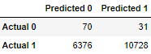</td><td>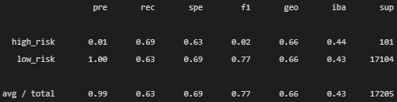</td></tr></table>
<hr>

### SMOTE Oversampling

We used the following code snippet to resample our training dataset, which caused each class to equally contain **51366** counts (identical to the counts of the majority class in the training dataset). **Table 2** showed the confusion matrix and imbalanced classification report of the SMOTE oversampling model. The balanced accuracy scores and condensed summary statistics are summarized in **Table 9** in the [Summary](#summary) section.

```
# Resample the training data with SMOTE
smote_os = SMOTE(random_state=seedn, sampling_strategy='auto')
X_resampled, y_resampled = smote_os.fit_resample(X_train, y_train)
Counter(y_resampled.value_counts())
```

<hr>

**Table 2. (a) Confusion matrix and (b) imbalanced classification report of the SMOTE oversampling model.**
<table><tr><td>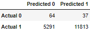</td><td>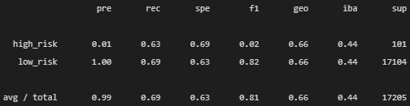</td></tr></table>
<hr>

### Cluster Centroid Undersampling

We used the following code snippet to resample our training dataset, which reduced each class to **246** counts (identical to the counts of the minority class in the training dataset). **Table 3** showed the confusion matrix and imbalanced classification report of the ClusterCentroids undersampling model. The balanced accuracy scores and condensed summary statistics are summarized in **Table 9** in the [Summary](#summary) section.

```
# Resample the data using the ClusterCentroids resampler
# Warning: This is a large dataset, and this step may take some time to complete
cc = ClusterCentroids(random_state=seedn)
X_resampled, y_resampled = cc.fit_resample(X_train, y_train)
Counter(y_resampled.value_counts())
```

<hr>

**Table 3. (a) Confusion matrix and (b) imbalanced classification report of the ClusterCentroids undersampling model.**
<table><tr><td>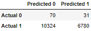</td><td></td></tr></table>
<hr>

## Deliverable 2: Use the SMOTEENN Algorithm to Predict Credit Risk

Using our knowledge of the imbalanced-learn and scikit-learn libraries, we employed a combinatorial approach of over- and under-sampling with the SMOTEENN algorithm to determine if the results from the combinatorial approach are better at predicting credit risk than the resampling algorithms from Deliverable 1. We used the following code snippet to resample our training dataset, which further rebalanced each class to contain **51361** and **46653** counts, respectively. **Table 4** showed the confusion matrix and imbalanced classification report of the combinatorial SMOTEENN model. The balanced accuracy scores and condensed summary statistics are summarized in **Table 9** in the [Summary](#summary) section.

```
# Resample the training data with SMOTEENN
# Warning: This is a large dataset, and this step may take some time to complete
smote_enn = SMOTEENN(random_state=seedn)
X_resampled, y_resampled = smote_enn.fit_resample(X_train, y_train)
Counter(y_resampled.value_counts())
```

<hr>

**Table 4. (a) Confusion matrix and (b) imbalanced classification report of the combinatorial SMOTEENN model.**
<table><tr><td>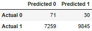</td><td>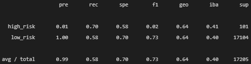</td></tr></table>
<hr>

## Deliverable 3: Use Ensemble Classifiers to Predict Credit Risk

Using our knowledge of the imblearn.ensemble library, we trained and compared two different ensemble classifiers, BalancedRandomForestClassifier and EasyEnsembleClassifier, to predict credit risk and evaluate each model. Using both algorithms, we resampled the dataset, viewed the count of the target classes, trained the ensemble classifier, calculated the balanced accuracy score, generated a confusion matrix, and generated a classification report. The source code can be referred in [credit_risk_ensemble.ipynb](./credit_risk_ensemble.ipynb).

### Balanced Random Forest Classifier 

**Table 5** showed the confusion matrix and imbalanced classification report achieved by running the BalancedRandomForestClassifier ensemble learning model. **Table 6** illustrated the top 10 features sorted in descending order by feature importance after applying the BalancedRandomForestClassifier ensemble learning model. The complete list of features can also be reviewed in [brf_model_sorted_feature_importance.csv](./Data/brf_model_sorted_feature_importance.csv). The balanced accuracy scores and condensed summary statistics are summarized in **Table 9** in the [Summary](#summary) section.

<hr>

**Table 5. (a) Confusion matrix and (b) imbalanced classification report of the BalancedRandomForestClassifier ensemble learning model.**
<table><tr><td>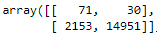</td><td>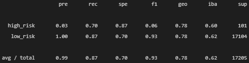</td></tr></table>
<hr>

**Table 6. Top 10 features sorted in descending order by feature importance.**  
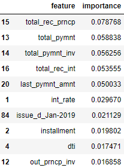
<hr>

### Easy Ensemble Classifier

**Table 7** showed the confusion matrix and imbalanced classification report achieved by running the EasyEnsembleClassifier ensemble learning model. The balanced accuracy scores and condensed summary statistics are summarized in **Table 9** in the [Summary](#summary) section.

<hr>

**Table 7. (a) Confusion matrix and (b) imbalanced classification report of the EasyEnsembleClassifier ensemble learning model.**
<table><tr><td>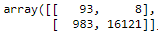</td><td>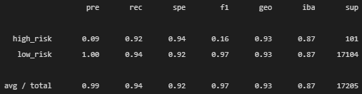</td></tr></table>
<hr>

### Adaptive Boosting Classifier

**Table 8** showed the confusion matrix and imbalanced classification report achieved by running the EasyEnsembleClassifier ensemble learning model. The balanced accuracy scores and condensed summary statistics are summarized in **Table 9** in the [Summary](#summary) section.

<hr>

**Table 8. (a) Confusion matrix and (b) imbalanced classification report of the AdaBoostClassifier ensemble learning model.**
<table><tr><td>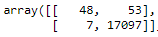</td><td>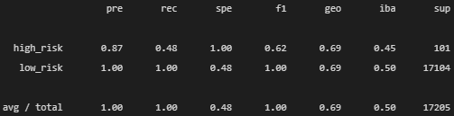</td></tr></table>
<hr>

## Summary

All deliverables have been completed and analyzed according to the assignment requirements, including code refactoring, and quality assurance for ensuring accurate results. I hope our stakeholders will be able to benefit from the condensed summary statistics tables instead of bulleted lists and easily compare the results achieved by applying various machine learning algorithms before drawing the final conclusions.

**Table 9. Condensed summary atatistics of all the imbalanced resampling models. Precision, Recall, and F1 score are the avg/total values (Used metrics: low &lt; 60%, good = 60&ndash;70%, very good = 70&ndash;90%, high &gt; 90%).**  
| ML method              | Balanced accuracy score | Precision | Recall  | F1 score | Conclusion                                      |
| :--                    |                     --: |       --: |     --: |      --: | :--:                                            |
| RandomOverSampler      | 0.660146                | 0.99      |    0.63 |  0.77    | Good accuracy/recall, very good F1 score        |
| SMOTE                  | 0.662160                | 0.99      |    0.69 |  0.81    | Good accuracy/recall, very good F1 score        |
| ClusterCentroids       | 0.544734                | 0.99      |    0.40 |  0.56    | *Low accuracy/recall, low F1 score*             |
| SMOTEENN               | 0.639283                | 0.99      |    0.58 |  0.73    | Good accuracy, *low recall*, very good F1 score |
| BalancedRandomForest   | 0.788547                | 0.99      |    0.87 |  0.93    | Good accuracy/recall, **high F1 score**         |
| EasyEnsembleClassifier | 0.931660                | 0.99      |    0.94 |  0.97    | **Highest accuracy**, **high recall/F1 score**  |
| AdaBoostClassifier     | 0.737419                | 1.00      |    1.00 |  1.00    | Very good accuracy, **highest recall/F1 score** |

**Table 9** provided the comparison and executive summary across the oversampling, undersampling, over- and under-sampling combinational approach, ensemble learning (aka bootstrap aggregation) technique, and adaptive boosting technique that we have analyzed thus far. Our analysis results suggested that:

- SMOTE oversampling technique performed the best and provided the least bias towards predicting the high_risk loan statuses amongst the over- and under-sampling learning models (**Table 2**, **Table 9**).
- The ClusterCentroids undersampling technique seemed to provide the worst overall results and hence, I would recommend to avoid using this model for predicting credit risk. The undersampling model might have deleted some valuable samples from the majority class when resampling our training dataset  (**Table 3**, **Table 9**).
- The **EasyEnsembleClassifier** ensemble learning model seemed to provide the highest balanced accuracy score and well balanced recall (sensitivity) scores between the high_risk and low_risk loan statuses (**Table 7**, **Table 9**).
- Another ensemble learning model called **AdaBoostClassifier** that I additionally validated seemed to provide an extremely strong prediction result, however, it might be too aggressive by just looking at its perfect precision, recall, and F1 scores. We have to consider whether we should use depending on the business objectives because this model provided the lowest sensitivity in predicting the high_risk loan statuses  (**Table 8**, **Table 9**).

## References

[Pandas User Guide](https://pandas.pydata.org/pandas-docs/stable/user_guide/index.html#user-guide)  
[Scikit-learn User Guide: Supervised Learning](https://scikit-learn.org/stable/supervised_learning.html)  
[Python imbalanced-learn](https://pypi.org/project/imbalanced-learn/)  
[Ensemble methods](https://imbalanced-learn.org/stable/references/ensemble.html#)  
[sklearn.ensemble.AdaBoostClassifier](https://scikit-learn.org/stable/modules/generated/sklearn.ensemble.AdaBoostClassifier.html#sklearn.ensemble.AdaBoostClassifier)  
[How to interpret classification report of scikit-learn?](https://datascience.stackexchange.com/questions/64441/how-to-interpret-classification-report-of-scikit-learn)  
[Tour of Evaluation Metrics for Imbalanced Classification](https://machinelearningmastery.com/tour-of-evaluation-metrics-for-imbalanced-classification/)  
[Random Oversampling and Undersampling for Imbalanced Classification](https://machinelearningmastery.com/random-oversampling-and-undersampling-for-imbalanced-classification/)  
[Online Statistics Education: A Multimedia Course of Study](https://onlinestatbook.com/2/index.html)  
[Linear regression models](https://people.duke.edu/~rnau/regintro.htm)  
[STAT 501: Regression Methods](https://online.stat.psu.edu/stat501/lesson/1/1.5)  
